# Technical Architecture — Hair Care Assortment Optimization Platform

## 1. Overview

The platform turns raw retail transaction, inventory, market, review, and SKU-master data into
SKU-level assortment decisions (Keep / Expand / Watch / Delist), new-SKU launch guidance, and
AI-generated category insights. Data lives in **PostgreSQL**, is transformed by a set of
**Python batch algorithms**, exposed through a **FastAPI** service layer (including three LLM-backed
agents), and rendered in a **React (Vite + TypeScript)** single-page application.

```
PostgreSQL  →  ETL (weekly aggregation)  →  Python algorithms  →  Output tables/CSVs
     →  AI Agents (LLM-backed insights)  →  FastAPI  →  React frontend
```

---

## 2. Architecture Diagram

```mermaid
flowchart TB
    subgraph DB["🗄️ PostgreSQL Database (Assortment)"]
        direction LR
        T1[(sales_tx)]
        T2[(inventory_report)]
        T3[(market_data)]
        T4[(reviews_social)]
        T5[(sku_master)]
        T6[(store_master)]
        T7[(sku_similarity_for_substitution)]
    end

    subgraph ETL["⚙️ ETL Layer — Backend/db.py"]
        E1["read_table_or_csv()\nPG first → CSV/XLSX fallback"]
        E2["_reconcile_columns()\nlowercase PG cols → CSV-case schema"]
        E3["Weekly aggregation\n(Year_WK grain)"]
    end

    subgraph ALGO["🧠 Python Algorithms (Backend/)"]
        A1["Forecasting.py\nLightGBM + Nixtla AutoETS\nper SKU x Store"]
        A2["StoreClustering/cluster.py\nWard hierarchical / BIRCH+PCA"]
        A3["Basket&ABC_Analysis/similarity.py\n4-group cosine/Jaccard SKU similarity"]
        A4["Basket&ABC_Analysis/basket_analysis.py\nAssociation rules + 8-factor delist score"]
        A5["NewSKU/sku_intelligence.py\n7-engine orchestrator: cannibalization,\nstore fit, scenario sim, whitespace, copilot"]
    end

    subgraph OUT["📦 Output Tables/Files (Outputs/)"]
        O1[weekly_demand_output.csv]
        O2[Forecast_Output.csv]
        O3[store_clusters.csv]
        O4[new_sku_similarity_scores.csv]
        O5[association_rules.csv]
        O6[sku_basket_insights.csv]
        O7[delisting_recommendations.csv]
        O8[demand_transfer_matrix.csv]
        O9["Assortment decision.csv"]
    end

    subgraph AGENTS["🤖 AI Agents (Backend/agents/) — OpenAI o3-mini"]
        AG1["Watchdog Agent\nanomaly detection"]
        AG2["Localization Agent\ncluster-vs-global divergence"]
        AG3["Brief Agent\nNL category briefs"]
        GR["guardrails.py\nprompt-injection / refusal checks"]
    end

    subgraph API["🚀 FastAPI (Backend/main.py)"]
        R1["/api/forecast"]
        R2["/api (general)"]
        R3["/api/new-sku"]
        R4["/api/decision-hub"]
        R5["/api/agents"]
    end

    subgraph FE["💻 React SPA (Frontend/src) — Vite + TypeScript"]
        F1["WorkspacePage\n(Category Insights dashboard)"]
        F2["DecisionHubPage\n(Assortment decisions)"]
        F3["NewSkuPage\n(New SKU Intelligence Hub)"]
        F4["AgentHubPage\n(Watchdog / Localization / Brief)"]
        FC["FilterContext.tsx\nshared cross-page filters"]
    end

    USER(["Category Manager"])

    DB --> ETL --> ALGO --> OUT
    OUT --> AGENTS
    GR --- AG1
    GR --- AG2
    GR --- AG3
    OUT --> API
    AGENTS --> API
    API -- "REST/JSON (axios)" --> FE
    FC -.-> F1
    FC -.-> F2
    FC -.-> F4
    FE --> USER
```



---

## 3. Data Layer — PostgreSQL

All source data is centralized in the **`Assortment`** PostgreSQL database. Every Backend module
reads through a single function, `read_table_or_csv()` in `Backend/db.py`, which:

1. Tries the PostgreSQL table (exact name, then lowercase) via a cached SQLAlchemy engine.
2. Reconciles PG's lowercase column names back to the original CSV title-case schema
   (`_reconcile_columns()`), so downstream code needs no PG-specific branching.
3. Falls back to the flat file in `Raw_Input/` or `Outputs/` if the table is missing or the DB is
   unreachable — keeping the system usable in dev/offline mode.

Connection parameters are read from a project-root `.env` (`PGHOST`, `PGPORT`, `PGDATABASE`,
`PGUSER`, `PGPASSWORD`) — never hardcoded in source.

| Table (Postgres) | Grain | Source file (fallback) |
|---|---|---|
| `sales_tx` | Transaction line (~200K rows) | `Raw_Input/Sales_Tx.csv` |
| `inventory_report` | Store × SKU × Day | `Raw_Input/Inventory_Report.csv` |
| `market_data` | Category/market level | `Raw_Input/Market_Data.csv` |
| `reviews_social` | SKU-level review/social sentiment | `Raw_Input/Reviews_Social.csv` |
| `sku_master` | SKU (60 rows) | `Raw_Input/SKU_Master.csv` |
| `store_master` | Store (10 rows) | `Raw_Input/Store_Master.csv` |
| `sku_similarity_for_substitution` | SKU pair | `Raw_Input/SKU_Similarity_For_Substitution.csv` |

`New_SKUs.csv` (candidate launch SKUs) also lives in `Raw_Input/` and feeds the New SKU
Intelligence pipeline.

---

## 4. ETL — Raw Transactions → Weekly Star Schema

`sales_tx` (transaction grain) and `inventory_report` (daily grain) are aggregated to a common
**weekly** grain (`Year_WK`) with quality gates for referential integrity, nulls, and calendar
continuity, producing `weekly_demand_output.csv` (Week × Store × SKU). This weekly table is the
shared input to forecasting, clustering, and basket analysis — run order matters: forecasting and
clustering should complete before basket analysis so it works off fresh weekly data.

---

## 5. Python Algorithms (Backend/)

| Module | File | Algorithm | Output |
|---|---|---|---|
| Demand Forecasting | `Forecasting/forecasting.py` | Dual-model per SKU×Store timeseries: LightGBM (n_estimators=500, lr=0.05) + Nixtla AutoETS; 6-week holdout, best model picked by MAE | `Forecast_Output.csv`, `Forecast_Validation.csv`, `weekly_demand_output.csv` |
| Store Clustering | `StoreClustering/cluster.py` | Ward-linkage hierarchical clustering (≤500 stores) or BIRCH+PCA (>500); auto-detects cluster count (cap 6) | `store_clusters.csv`, `store_clusters_summary.json` |
| New-SKU Similarity | `Basket&ABC_Analysis/similarity.py` | 4-group cosine/Jaccard similarity (Hierarchy 35%, Functional 25%, Ingredient 20%, Commercial 20%) | `new_sku_similarity_scores.csv`, `new_sku_analog_demand_forecast.csv` |
| Basket & Delisting | `Basket&ABC_Analysis/basket_analysis.py` | Association rule mining (min support 0.5%) + demand transfer matrix; 8-factor composite delist score (ABC 15%, Revenue 20%, Margin 20%, Support 15%, Lift 10%, Dependency 10%, Substitution 10%) with NL explanations | `association_rules.csv`, `sku_basket_insights.csv`, `demand_transfer_matrix.csv`, `delisting_recommendations.csv` |
| New SKU Intelligence | `NewSKU/sku_intelligence.py` (orchestrator, 7 engines) | Hierarchical forecast aggregation, cannibalization/incrementality, 5-factor store recommender, OLS price-elasticity scenario simulator, whitespace lattice detector, rule-based explainer, executive copilot (Go/Conditional Go/Test) | JSON payload via `/api/new-sku/intelligence` |

`demand_transfer_matrix.csv` and `sku_basket_insights.csv` from basket analysis are **inputs** to
the New SKU cannibalization engine — computed once, reused, not duplicated.

---

## 6. Agentic / Insights Layer (Backend/agents/)

Three LLM-backed agents, added on top of the deterministic algorithm outputs, using **OpenAI**
(model `o3-mini` by default, via `openai.AsyncOpenAI`, streamed as SSE):

| Agent | File | Purpose |
|---|---|---|
| Watchdog | `agents/watchdog_agent.py` | Flags top-N anomalies (demand/inventory/delist-risk) across SKUs/stores |
| Localization | `agents/localization_agent.py` | Detects cluster-vs-global recommendation divergence above a threshold |
| Brief | `agents/brief_agent.py` | Generates natural-language category briefs from the output tables |

Shared infrastructure:
- `services/guardrails.py` — prompt-injection detection and refusal handling before any LLM call.
- `services/agent_prompts.py` — prompt templates.
- `services/agent_llm.py` — OpenAI client wrapper, streaming, model/key config from `.env`.
- All three agents are feature-flagged (`ENABLE_WATCHDOG_AGENT`, `ENABLE_LOCALIZATION_AGENT`,
  `ENABLE_BRIEF_AGENT`, default `true`) and write audit artifacts to `Outputs/agent_localization_overrides.csv`
  and `Outputs/agent_briefs/*.json`.

---

## 7. API Layer — FastAPI (Backend/main.py)

A single FastAPI app (`Category Growth API`) wires up five routers, each a thin adapter over a
`services/*_service.py` module that calls `read_table_or_csv()` and the algorithm outputs:

| Router | Prefix | Backs |
|---|---|---|
| `routers/forecast.py` | `/api/forecast` | Forecast vs. actuals, treemap, SKU performance |
| `routers/general.py` | `/api` | Filters, KPIs, shared lookups |
| `routers/new_sku.py` | `/api/new-sku` | New SKU Intelligence Hub (8 endpoints incl. `POST /api/new-sku/intelligence`) |
| `routers/decision_hub.py` | `/api/decision-hub` | Assortment Keep/Expand/Watch/Delist decisions |
| `routers/agents.py` | `/api/agents` | Watchdog / Localization / Brief agent endpoints |

CORS is scoped to the Vite dev origin (`http://localhost:5173`). Served via `uvicorn main:app`.

---

## 8. Frontend — React + Vite + TypeScript (Frontend/src)

| Page | File | Purpose |
|---|---|---|
| Category Insights Workspace | `pages/WorkspacePage.tsx` | Filterable dashboard: KPIs, ABC Pareto, basket analytics, sales trend/forecast |
| Decision Hub | `pages/DecisionHubPage.tsx` | Keep/Expand/Watch/Delist recommendations |
| New SKU Intelligence Hub | `pages/NewSkuPage.tsx` | Go/No-Go, store rollout, cannibalization, scenario simulation, whitespace |
| Agent Hub | `pages/AgentHubPage.tsx` | Watchdog panel/banner, Localization table, Brief generator |

Supporting layers:
- `api/*.ts` (axios) — one typed client module per backend router (`generalApi`, `forecastApi`
  via `assortmentData.ts`, `decisionHubApi`, `newSkuApi`, `agentsApi`).
- `context/FilterContext.tsx` — a `GlobalFilters` React Context wrapping `<BrowserRouter>` in
  `App.tsx`, so Sub-Category/Store/Cluster/Brand filters persist across all pages via `useFilters()`.
- `components/` — `NavBar.tsx` plus per-feature folders (`decision_hub/`, `workspace/`, `agents/`, `ui/`).
- Styling: Tailwind CSS; charts: Plotly.js; grids: AG Grid; icons: lucide-react.

---

## 9. End-to-End Request Flow (example: Decision Hub page load)

```
Category Manager opens Decision Hub
  → React DecisionHubPage reads filters from FilterContext
  → decisionHubApi.ts issues GET /api/decision-hub/... (axios)
  → FastAPI decision_hub router → decision_hub_service.py
  → read_table_or_csv() → PostgreSQL (delisting_recommendations, sku_basket_insights, ...)
    (falls back to Outputs/*.csv if PG unreachable)
  → JSON response → React renders KPI cards, AG Grid table, Plotly charts
```

---

## 10. Technology Stack Summary

| Layer | Technology |
|---|---|
| Database | PostgreSQL (`psycopg2`, `SQLAlchemy`) |
| ETL / Algorithms | Python, pandas, numpy, scikit-learn, LightGBM, Nixtla/statsforecast, scipy |
| AI Agents | OpenAI API (`o3-mini`), custom guardrails |
| Backend API | FastAPI, uvicorn, Pydantic |
| Frontend | React 18, TypeScript, Vite, Tailwind CSS, Plotly.js, AG Grid, axios, React Router |
| Legacy/standalone | Streamlit (`Frontend/app.py`) — original MVP dashboard, retained alongside the React app |

---

## 11. Placeholder / Unimplemented Areas

- `Backend/category_health/`, `Backend/genai/` — empty, reserved for future category health
  scoring and generic GenAI features beyond the three current agents.
- Step 4.7 MILP optimization (OR-Tools), described in `ProcessFlow.md`, not yet coded.
- `Outputs/agent_audit_log.csv` — planned, not yet implemented.