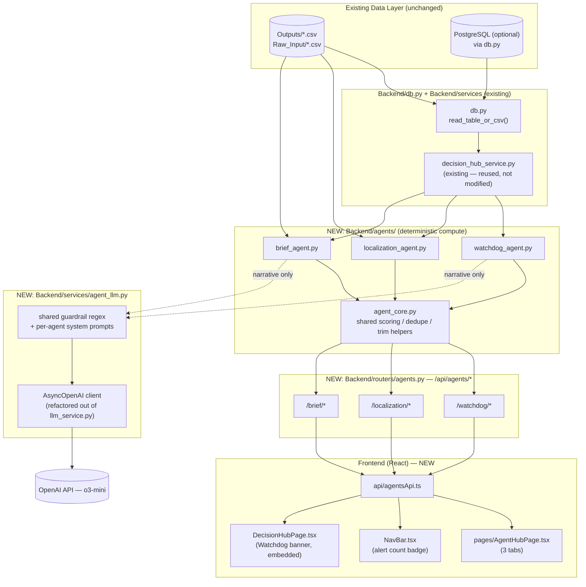
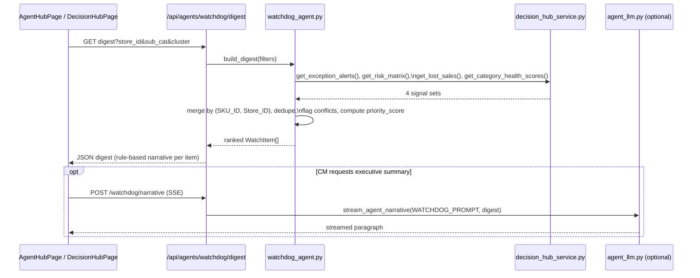
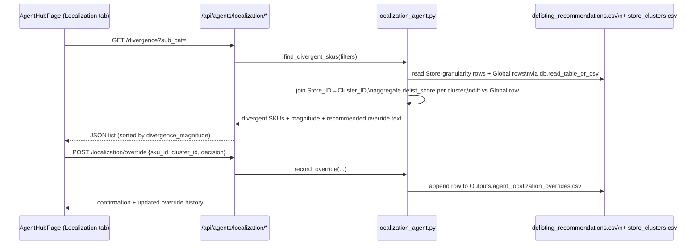

# Implementation Plan for AI Agents

**Scope:** Three agents added to the existing Hair Care Assortment Optimization platform:

| # | Agent Name | One-line purpose |
|---|------------|-------------------|
| 1 | **Assortment Watchdog Agent** | Proactive, ranked, cross-module exception digest (replaces manual tab-hopping) |
| 2 | **Cluster-Aware Localization Agent** | Flags where a global Keep/Delist recommendation is wrong for a specific store cluster |
| 3 | **Stakeholder Brief Agent** | Turns basket/delist analytics into ready-to-share vendor/merchandising briefs |

This document assumes the codebase state described in `CLAUDE.md` as of 2026-07-02: FastAPI backend (`Backend/main.py`), service-layer pattern (`Backend/services/*.py`) reading via `Backend/db.py` (`read_table_or_csv` — PostgreSQL-first, CSV/XLSX fallback), a React 18 + Vite + TypeScript frontend (`Frontend/src/`), and one existing LLM integration (`Backend/services/llm_service.py`, OpenAI `o3-mini`, SSE streaming, regex+prompt guardrails) consumed by the Decision Hub's `AICopilot.tsx`. No authentication layer, no CI/CD, and no automated test suite currently exist — these gaps are called out explicitly where they affect the agents.

---

## 1. Executive Summary

### 1.1 Purpose of each agent

**Assortment Watchdog Agent** — `decision_hub_service.py` already computes exception alerts (`get_exception_alerts`), risk buckets (`get_risk_matrix`), lost sales (`get_lost_sales`), and category health (`get_category_health_scores`) — but as four separate, unranked views the Category Manager (CM) must check individually. The Watchdog agent merges these signals into one prioritized worklist per review cycle, surfaces conflicts (e.g., a SKU that is both a top basket anchor *and* a delist candidate), and renders a short data-grounded narrative explaining what to do first.

**Cluster-Aware Localization Agent** — `basket_analysis.py` computes delist recommendations at `Global`, `Store`, `Geography`, and `Channel` granularity (`delisting_recommendations.csv`), but never at `Store_Cluster` granularity (`store_clusters.csv`, produced by `cluster.py`). A SKU that is "Recommend Delist" globally may be a strong performer in one cluster (e.g., "Digital-First Urban") and dead weight in another ("Rural Remote"). This agent detects that divergence and lets the CM approve a cluster-specific override instead of applying the blanket decision everywhere.

**Stakeholder Brief Agent** — `association_rules.csv`, `sku_basket_insights.csv`, and `delisting_recommendations.csv` (which already carries a rule-based `Recommendation_Narrative` field, see `basket_analysis.py`) contain the full analytical case for a vendor negotiation, a cross-sell/planogram proposal, or a delist justification — but turning that into a shareable document is still manual. This agent assembles a structured, exportable brief from those existing outputs.

### 1.2 Business value

| Agent | CM pain point removed | Business team benefit |
|---|---|---|
| Watchdog | Manually checking 4+ dashboard tabs to find "what matters today" | Faster reaction to stockout/delist conflicts → fewer missed revenue-at-risk events |
| Localization | Blanket delist/keep decisions ignore cluster-level performance | Protects revenue in strong clusters; sharper, defensible localization |
| Stakeholder Brief | Manual deck-building for vendor/merchandising reviews | Faster negotiation cycles; consistent, data-backed talking points |

### 1.3 Expected outcomes and success metrics

- **Watchdog:** reduction in time-to-detect a Stock-out/Delist-conflict SKU (target: same-day surfacing vs. current ad-hoc review); CM adoption measured by daily digest views.
- **Localization:** number of approved cluster overrides that materially change a Keep/Delist call vs. the global recommendation; estimated revenue protected per quarter (sum of `total_sales_6wk` for overridden SKUs in the cluster where the override applies).
- **Stakeholder Brief:** reduction in manual prep time per vendor/merchandising review (baseline: current manual effort, self-reported); number of briefs generated and exported per month.
- All three agents are read-mostly and additive — success also means **zero regressions** to the existing Decision Hub, New SKU Intelligence Hub, and their current AI Copilots.

---

## 2. Solution Architecture

### 2.1 High-level architecture



Key architectural principle: **the agents layer sits on top of the existing `decision_hub_service.py` computations rather than replacing or duplicating them.** All three agents are additive — no existing file in `Backend/services/` or `Backend/routers/` is modified except `Backend/main.py` (one new `include_router` line) and `Backend/services/llm_service.py` (extracted into a shared, parameterized module — see §5).

### 2.2 Agent orchestration approach

**No agent-to-agent orchestration or autonomous multi-step planning.** Each agent is a single deterministic pipeline ("compute → rank/detect → optionally narrate") triggered synchronously by an HTTP request, matching the existing pattern used by `decision_hub_service.py` + `llm_service.py`. This is a deliberate simplification — see §5.1 for the rationale against a multi-agent framework.

### 2.3 Interaction between UI, APIs, services, LLMs, existing components

- **UI → API:** `Frontend/src/api/agentsApi.ts` (new, mirrors `decisionHubApi.ts`) calls `/api/agents/*` via `axios`/`fetch`, same pattern as `decisionHubApi.ts` and `streamCopilot`.
- **API → Service:** `Backend/routers/agents.py` calls pure functions in `Backend/agents/*.py`; no business logic lives in the router (matches `decision_hub.py`).
- **Service → Data:** `Backend/agents/*.py` calls existing `decision_hub_service.py` functions (`get_exception_alerts`, `get_risk_matrix`, `_delist_raw`, etc.) and, where new joins are needed (e.g., `store_clusters.csv`), reads via `db.py.read_table_or_csv`, never re-implementing CSV/PG access.
- **Service → LLM:** only the *narrative* step calls `agent_llm.py`, passing a trimmed JSON context (same discipline as `build_copilot_context`'s `_trim()` helper) — never raw transaction-level data.
- **Existing components untouched:** `Forecasting/`, `Basket&ABC_Analysis/`, `StoreClustering/`, `NewSKU/` pipelines are read-only inputs; the agents never trigger a re-run of these batch jobs.

### 2.4 Data flow per agent

**Watchdog Agent**


**Cluster-Aware Localization Agent**


**Stakeholder Brief Agent**
```mermaid
sequenceDiagram
    participant UI as AgentHubPage (Brief tab)
    participant API as /api/agents/brief/generate
    participant BA as brief_agent.py
    participant CSV as association_rules.csv,\nsku_basket_insights.csv,\ndelisting_recommendations.csv
    participant LLM as agent_llm.py

    UI->>API: POST {brief_type, scope}
    API->>BA: build_brief(brief_type, scope)
    BA->>CSV: pull scoped rows (brand/sub_cat/sku_ids)
    BA->>BA: template sections (rule-based, like NewSKU/copilot.py)
    BA->>LLM: optional: polish tone / write executive intro\n(guarded, context-only)
    LLM-->>BA: polished text (or skipped if LLM disabled)
    BA-->>API: brief object (sections + markdown export)
    API-->>UI: brief JSON; UI offers copy/export
```

---

## 3. Agent Specifications

### 3.1 Assortment Watchdog Agent

- **Business Problem Solved:** Exception signals are already computed but scattered across the Risk Matrix, Lost Sales, Exception Alerts, and Delist Rationalization views. The CM has no single ranked "what do I act on today" list, and no visibility into cases where two signals conflict on the same SKU (e.g., flagged both as a basket-critical Keep and a top delist candidate).
- **User Personas:** Category Manager (primary, daily use); Merchandising Analyst (secondary, weekly review).
- **Inputs / Data Sources:** `decision_hub_service.get_exception_alerts()`, `get_risk_matrix()`, `get_lost_sales()`, `get_category_health_scores()` — all existing, no new data pipeline.
- **Processing Logic:**
  1. Pull the four signal sets for the current filter (`store_id`, `sub_cat`, `cluster`).
  2. Normalize each into a common `WatchItem` shape keyed by `(SKU_ID, Store_ID)`.
  3. Merge/dedupe: if the same key appears in more than one signal set, mark `conflict = true` and union the `signal_types`.
  4. Compute `priority_score = severity_weight × financial_impact_norm + conflict_bonus` (severity weights: red=3, orange=2, green=1; conflict_bonus=+1 tier when `signal_types` length > 1; `financial_impact_norm` = min-max normalized `financial`/`Lost_Revenue`/`total_sales_6wk` field already present on each source row).
  5. Sort descending by `priority_score`, cap at `top_n` (default 10, max 50).
  6. Attach a rule-based one-line narrative per item (templated, no LLM call) — e.g. `f"{sku_name} is both a Stock-out Risk (WoC {woc:.1f}) and a Delist Candidate (score {score:.2f}) — resolve the conflict before reordering."`
  7. Optional: on explicit CM request, stream one executive-summary paragraph over the top N items via `agent_llm.py` (reuses the SSE pattern in `llm_service.stream_copilot`).
- **AI/LLM Capabilities Required:** None for the core ranked list (fully deterministic). One narrow LLM call (existing `o3-mini`, same guardrail pattern) only for the optional executive summary — this keeps cost and hallucination surface minimal.
- **Outputs and Recommendations:** Ranked `WatchItem[]` with `priority_rank`, `severity`, `signal_types`, `financial_impact_usd`, `suggested_action`, `narrative`; optional streamed summary paragraph.
- **User Experience Flow:** CM opens Decision Hub → sees a "Today's Priorities" banner (top 3 items) pulled from the digest → clicks through to the full Agent Hub Watchdog tab for the ranked list → can click "Generate Executive Summary" for the LLM paragraph → clicking an item opens the existing `SKUDrawer.tsx` for full drilldown (reuses `get_sku_drilldown`).
- **Example User Queries:** "What needs my attention today for Shampoo?" (`sub_cat=Shampoo` filter) · "Show me conflicts between delist and basket-critical SKUs" (surfaced automatically via `conflict=true` filter) · "Summarize this week's priorities for the leadership review" (triggers the LLM narrative).
- **Error Handling and Edge Cases:** Empty filter result → return `{"items": [], "summary": {...zeros...}}` (same zero-fill pattern as `get_hub_kpis`); one signal source empty (e.g., no alerts) → digest still builds from the remaining sources; LLM unavailable/`OPENAI_API_KEY` missing → narrative endpoint returns the same `[ERROR: ...]` SSE convention already used by `llm_service.py`, ranked list still renders without it; duplicate SKU across multiple stores → each `(SKU_ID, Store_ID)` pair is a distinct item, but the summary rolls up SKU-level totals to avoid double-counting financial impact in the top banner.

### 3.2 Cluster-Aware Localization Agent

- **Business Problem Solved:** `delisting_recommendations.csv` is scored at Global/Store/Geography/Channel granularity but never at Store_Cluster granularity, so a globally-recommended delist can silently destroy revenue in a cluster where the SKU is actually thriving (and vice versa for keep decisions in weak clusters).
- **User Personas:** Category Manager (approves/rejects overrides); Regional Merchandising Lead (reviews cluster-specific asks).
- **Inputs / Data Sources:** `Outputs/delisting_recommendations.csv` filtered to `granularity_level == "Store"` and `granularity_level == "Global"`; `Outputs/store_clusters.csv` (`Store_ID`, `Cluster_ID`, `Cluster_Label`); `Outputs/weekly_demand_output.csv` / `Forecast_Output.csv` for cluster revenue context (via existing `decision_hub_service._base_frame()`).
- **Processing Logic:**
  1. Load Store-level delist rows, join `Store_ID → Cluster_ID/Cluster_Label` from `store_clusters.csv`.
  2. Aggregate `delist_score` (median) and `total_revenue`/`total_margin` per `(SKU_ID, Cluster_ID)`.
  3. Join against the SKU's Global-level `delist_score`/`Decision`.
  4. Compute `divergence_magnitude = |cluster_delist_score − global_delist_score|`; flag `divergence_flag = true` when it exceeds a configurable threshold (default 0.20 on the existing 0–1 `delist_score` scale).
  5. For flagged SKUs, derive a `recommended_override` string via a rule table (e.g., cluster score in "Keep" band while global is "Recommend Delist" → `"Keep in {Cluster_Label}; proceed with Delist elsewhere"`).
  6. Sort by `divergence_magnitude` descending; return top matches.
  7. On CM action, persist the decision (`approved`/`rejected`, free-text `note`) — **this is the one write-capable action set** in the whole plan.
- **AI/LLM Capabilities Required:** None. This agent is entirely rule-based arithmetic on existing numeric fields — no LLM call needed or recommended (numbers must be exact; templated text is safer and cheaper here).
- **Outputs and Recommendations:** `DivergentSKU[]` with `global_decision`, `global_delist_score`, `cluster_breakdown[]` (per-cluster score/decision/store_count/revenue), `divergence_magnitude`, `recommended_override`; an append-only override audit log.
- **User Experience Flow:** CM opens Agent Hub → Localization tab → sees SKUs sorted by divergence → expands a SKU to see the per-cluster breakdown table (reuses `PlotlyChart.tsx`/`SKUTable.tsx` patterns) → clicks **Approve Override** or **Reject** with an optional note → decision is logged and reflected in a "My Overrides" history view.
- **Example User Queries:** "Which delist recommendations don't hold up for Digital-First Urban stores?" · "Show me SKUs where Rural Remote disagrees with the global Keep decision." · "What have I already overridden this quarter?"
- **Error Handling and Edge Cases:** SKU present in only one cluster (no true divergence possible) → excluded from results; `store_clusters.csv` missing or stale (cluster count changed after a `cluster.py` re-run) → agent logs a warning and falls back to Global-only view with a banner: "Cluster data may be stale — re-run Store Clustering"; duplicate override submissions for the same `(SKU_ID, Cluster_ID)` → latest write wins, prior entries retained in the audit log (never overwritten in place); malformed/missing `note` field → accepted as optional, not required for the write to succeed.

### 3.3 Stakeholder Brief Agent

- **Business Problem Solved:** The analytical case for a vendor negotiation or a delist justification already exists in `Recommendation_Narrative` (rule-based, from `basket_analysis.py`), `association_rules.csv`, and `sku_basket_insights.csv`, but assembling it into a shareable document is a manual, repeated task for every review cycle.
- **User Personas:** Category Manager (generates and reviews briefs before sharing); Vendor/Merchandising stakeholders (external consumers of the exported document — never given direct agent access).
- **Inputs / Data Sources:** `Outputs/association_rules.csv`, `Outputs/sku_basket_insights.csv`, `Outputs/delisting_recommendations.csv`, `Raw_Input/SKU_Master.csv` (brand/vendor attributes).
- **Processing Logic:**
  1. Resolve `scope` (brand, sub-category, or explicit `sku_ids`) to a row set across the three source files.
  2. Build fixed sections per `brief_type`:
     - `vendor_negotiation`: top cross-sell pairs (`association_rules.csv` sorted by `lift`/`confidence`), delist rationale for underperforming SKUs in scope (`Recommendation_Narrative`), a suggested ask (shelf space / promo funding / cost concession) chosen from a rule table keyed on `Basket_Role` + `delist_score` band.
     - `cross_sell`: ranked bundle/placement opportunities from `association_rules.csv` + `sku_basket_insights.csv` (`cross_category_relationships`, `promo_halo_impact`).
     - `delist_rationale`: one section per SKU using the existing `Recommendation_Narrative`, `Decision_Reason`, and `substitution_score` fields — no new text generation logic needed, just formatting.
  3. Each section is templated (Python f-strings), following the exact pattern already used in `Backend/NewSKU/copilot.py`'s `_gen_launch_overview`-style generators — deterministic, no hallucination risk.
  4. Optional LLM polish pass: a single call to `agent_llm.py` with a strict prompt ("rewrite for executive tone; do not add, remove, or alter any number or SKU name") over the assembled draft — never generates figures itself.
  5. Persist the brief (JSON + Markdown) under `Outputs/agent_briefs/{brief_id}.json` for later retrieval/audit.
- **AI/LLM Capabilities Required:** Optional tone-polishing only, using the existing `o3-mini` integration; all facts/figures come from the deterministic template, never from the model.
- **Outputs and Recommendations:** A brief object: `{brief_id, brief_type, scope, sections: [{heading, body}], generated_at, export: {markdown, text}}`.
- **User Experience Flow:** CM opens Agent Hub → Brief tab → selects brief type + scope (brand/sub-category/SKU multi-select, reusing `SmartFilterBar.tsx` patterns) → clicks Generate → reviews the draft inline → optionally clicks "Polish tone" (LLM pass) → clicks Copy/Export Markdown; **no automated external send** — export is manual by design (see §8).
- **Example User Queries (used as `scope`/`brief_type` selections, not free text):** "Generate a vendor negotiation brief for Brand X in Shampoo." · "Give me a cross-sell brief for the Conditioner sub-category." · "Draft a delist rationale for these 5 SKUs before Friday's review."
- **Error Handling and Edge Cases:** Empty scope (no matching rows) → return a brief with a single "No qualifying data for this scope" section rather than failing; `association_rules.csv` has no pairs above the support threshold for the scope → cross-sell section explicitly states "No statistically significant basket pairs found," never fabricated; LLM polish call fails/times out → return the deterministic draft unmodified with a `polish_failed: true` flag, never block brief generation on the LLM step; user selects a `brief_type` with an empty template rule (e.g., unmapped `Basket_Role`) → default to a generic "Recommended Action" fallback line already present in `Recommended_Action`.

---

## 4. Technical Design

### 4.1 Backend components to be added

```
Backend/
  agents/
    __init__.py
    agent_core.py            # shared: priority scoring, dedupe, trim(), divergence math
    watchdog_agent.py         # build_digest(), stream_digest_summary()
    localization_agent.py     # find_divergent_skus(), record_override(), list_overrides()
    brief_agent.py            # build_brief(), TEMPLATE registry, list_briefs(), get_brief()
  services/
    agent_llm.py               # refactor of llm_service.py — generic stream_agent_response()
  routers/
    agents.py                  # /api/agents/* — thin, calls Backend/agents/*
Outputs/
  agent_watchdog_digest_log.csv       # append-only history for trend/audit (optional Phase 5)
  agent_localization_overrides.csv    # append-only override decisions
  agent_briefs/{brief_id}.json        # generated briefs
  agent_audit_log.csv                 # who/when/what for every agent write action
```

`Backend/main.py` gains one import block and three `include_router` calls, mirroring the existing four:
```python
from .routers.agents import router as agents_router
app.include_router(agents_router, prefix="/api/agents", tags=["Agents"])
```

### 4.2 Frontend/UI changes

```
Frontend/src/
  api/agentsApi.ts                       # mirrors decisionHubApi.ts
  pages/AgentHubPage.tsx                 # 3 tabs: Watchdog / Localization / Brief
  components/agents/
    WatchdogPanel.tsx                    # ranked list + severity badges (reuse DecisionBadge.tsx)
    WatchdogBanner.tsx                   # top-3 embed for DecisionHubPage.tsx
    LocalizationTable.tsx                # divergence table + approve/reject actions
    BriefGenerator.tsx                   # scope form + generated brief viewer/export
```

- `App.tsx`: add `const AgentHubPage = lazy(() => import('./pages/AgentHubPage'))` and one `<Route path="/agent-hub" element={<AgentHubPage />} />`.
- `NavBar.tsx`: add one entry `{ to: '/agent-hub', label: '🕵️ Agent Hub' }` to the `NAV` array, and (Phase 5) a small alert-count badge fed by `GET /api/agents/watchdog/digest?top_n=1` (`summary.red` count).
- `DecisionHubPage.tsx`: embed `WatchdogBanner.tsx` above the existing KPI header — read-only, links into `/agent-hub`.
- `SKUDrawer.tsx`: no structural change; the Watchdog and Localization panels navigate into it using the SKU/store IDs it already accepts.

### 4.3 API contracts

All endpoints are prefixed `/api/agents` and follow the existing query-param filter convention (`store_id`, `sub_cat`, `cluster`) used by `/api/decision-hub/*`.

**Watchdog**
```
GET /api/agents/watchdog/digest?store_id=&sub_cat=&cluster=&top_n=10
→ 200 {
    "generated_at": "2026-07-02T08:00:00Z",
    "filters_applied": {...},
    "summary": {"total_items": 18, "red": 5, "orange": 9, "green": 4,
                "total_financial_impact_usd": 482000},
    "items": [{
      "priority_rank": 1, "priority_score": 92.4,
      "sku_id": "SKU-0123", "product_name": "...", "store_id": "ST-04",
      "signal_types": ["Stock-out Risk", "Delist Candidate"],
      "conflict": true, "severity": "red",
      "financial_impact_usd": 18400,
      "suggested_action": "Escalate: conflicting signals",
      "narrative": "...", 
      "source_signals": {"WoC": 1.2, "delist_score": 0.83}
    }]
  }

POST /api/agents/watchdog/narrative     (SSE, same framing as /copilot/stream)
  body: {store_id?, sub_cat?, cluster?, top_n?}
  → text/event-stream, "data: <token>\n\n" ... "data: [DONE]\n\n"
```

**Localization**
```
GET /api/agents/localization/divergence?sub_cat=&min_divergence=0.2
→ 200 [{
    "sku_id": "...", "product_name": "...", "sub_category": "...", "brand": "...",
    "global_decision": "Recommend Delist", "global_delist_score": 0.81,
    "cluster_breakdown": [
      {"cluster_id": "C1", "cluster_label": "Digital-First Urban",
       "cluster_delist_score": 0.22, "cluster_decision": "Keep",
       "store_count": 4, "cluster_revenue": 52000}
    ],
    "divergence_flag": true, "divergence_magnitude": 0.59,
    "recommended_override": "Keep in Digital-First Urban; Delist elsewhere"
  }]

POST /api/agents/localization/override
  body: {"sku_id": "...", "cluster_id": "...", "decision": "approved"|"rejected", "note": "optional"}
  → 200 {"status": "recorded", "row_id": "..."}

GET /api/agents/localization/overrides?sku_id=&cluster_id=
  → 200 [ ...audit history... ]
```

**Stakeholder Brief**
```
POST /api/agents/brief/generate
  body: {"brief_type": "vendor_negotiation"|"cross_sell"|"delist_rationale",
         "scope": {"brand"?: "...", "sub_cat"?: "...", "sku_ids"?: ["..."]}}
  → 200 {"brief_id": "...", "brief_type": "...", "sections": [{"heading": "...", "body": "..."}],
         "generated_at": "...", "export": {"markdown": "...", "text": "..."}}

POST /api/agents/brief/{brief_id}/polish     (SSE — optional LLM tone pass)

GET /api/agents/brief/{brief_id}             (retrieve a previously generated brief)
GET /api/agents/brief?brand=&sub_cat=        (list history)
```

Pydantic request models follow the existing `CopilotRequest(BaseModel)` pattern in `decision_hub.py`.

### 4.4 Database / schema changes

No schema changes to existing PostgreSQL tables or CSV contracts. New, isolated artifacts only:

- `Outputs/agent_localization_overrides.csv` — columns: `override_id, sku_id, cluster_id, cluster_label, decision, note, decided_by, decided_at`.
- `Outputs/agent_briefs/*.json` — one file per generated brief (mirrors the existing file-based philosophy stated in `CLAUDE.md`).
- `Outputs/agent_audit_log.csv` — columns: `event_id, agent, action, user, filters_json, model_used, tokens_used, timestamp`.
- If PostgreSQL is configured (per the [[project_pg_migration]] memory), `db.py` should gain a companion `write_table_or_csv()` (append semantics) so these three artifacts can optionally be persisted to PG tables (`agent_localization_overrides`, `agent_briefs`, `agent_audit_log`) using the same table-name-first, CSV-fallback contract as reads. This is scoped to Phase 5 / future work, not MVP (see §11).

### 4.5 Configuration management

Extends the existing root `.env` (already loaded by both `llm_service.py` and `db.py` via a private `_load_env()` — recommend consolidating to one shared loader in Phase 1, see §6):

```
# existing
OPENAI_API_KEY=...
LLM_MODEL=o3-mini
PGHOST=... PGPORT=... PGDATABASE=... PGUSER=... PGPASSWORD=...

# new
ENABLE_WATCHDOG_AGENT=true
ENABLE_LOCALIZATION_AGENT=true
ENABLE_BRIEF_AGENT=true
WATCHDOG_DIVERGENCE... (n/a)
LOCALIZATION_DIVERGENCE_THRESHOLD=0.20
AGENT_LLM_MAX_TOKENS=1200
```

Feature flags are read once at `main.py` startup; a disabled agent's router is simply not included — no dynamic config service required (matches "favor simple solutions").

### 4.6 Authentication and authorization considerations

**Current state:** the application has no authentication layer — `NavBar.tsx` hardcodes a single "👤 Category Manager" persona, and CORS in `main.py` is restricted to `localhost:5173` (dev-only). This is acceptable for the existing read-only dashboards but changes risk profile once **write** actions exist (Localization overrides) and **externally-shareable content** is produced (Stakeholder Briefs).

**Recommendation for this initiative:**
- MVP: no new auth system is in scope (avoid scope creep beyond the three agents), but every write endpoint (`POST /localization/override`, `POST /brief/generate` when it will be exported) must accept a `decided_by`/`generated_by` field from the client (free-text name, sourced from whatever session identity is available) so the audit log is never anonymous.
- Flag as a **pre-production gap**: before wider rollout, gate `/api/agents/localization/override` and any future "send brief externally" endpoint behind at least a shared API key or corporate SSO check — do not ship an auto-send capability until that exists.

---

## 5. Agent Framework Design

### 5.1 Agent architecture pattern: single-agent, compute-then-narrate — explicitly not multi-agent

Each of the three agents is a **single deterministic pipeline** (pandas transforms over existing CSV/PG outputs) with an optional, narrowly-scoped LLM call at the end for narrative text. There is:

- **No multi-agent framework** (LangChain, AutoGen, CrewAI, etc.).
- **No autonomous tool-calling loop** — the LLM never decides which data to fetch; the Python pipeline always fetches deterministically first, then hands the LLM a fixed, pre-trimmed JSON context (same discipline as the existing `build_copilot_context`).
- **No RAG / vector database** — the entire dataset (60 SKUs × 10 stores per `CLAUDE.md`) fits comfortably in a single JSON context window; retrieval-augmented generation would add infrastructure (embeddings, a vector store, chunking) with no benefit at this data scale. Revisit only if SKU/store counts grow by orders of magnitude (see §11.3).

This mirrors the codebase's existing precedent: `NewSKU/copilot.py` (rule-based NL) and `llm_service.py` (single-shot LLM over a trimmed context) both avoid agentic loops. The three new agents extend that same pattern rather than introducing a new paradigm.

### 5.2 Tool calling strategy

None required. "Tools" in the agentic sense (function-calling, dynamic retrieval) are unnecessary because every input dataset is already known and small; the Python service layer performs all data access before any LLM call. If a future enhancement needs the LLM to answer free-form questions across all three agents' outputs (an "agent-of-agents" copilot), a single OpenAI function-calling layer could be added on top — explicitly deferred to §11.2 as a future enhancement, not MVP.

### 5.3 Prompt management

- Consolidate all system prompts (existing `SYSTEM_PROMPT` in `llm_service.py` plus three new ones) into `Backend/services/agent_prompts.py` as named constants: `COPILOT_PROMPT`, `WATCHDOG_PROMPT`, `BRIEF_POLISH_PROMPT`. (Localization needs no prompt — it never calls an LLM.)
- Each prompt keeps the existing guardrail structure verbatim: refuse out-of-scope questions with the fixed refusal sentence, ground every claim in supplied numbers, cap output length.
- `agent_llm.py` exposes one generic function: `stream_agent_response(system_prompt: str, context: dict, question: str = "") -> AsyncGenerator[str]`, parameterized so `llm_service.stream_copilot` becomes a one-line wrapper calling it with `COPILOT_PROMPT` — preserves backward compatibility for the existing `AICopilot.tsx` with zero frontend changes.

### 5.4 Context retrieval strategy

Deterministic, code-driven, not LLM-driven: each agent's Python pipeline decides exactly which rows/columns to include (reusing the `_trim()` pattern from `decision_hub_service.build_copilot_context`) before constructing the LLM payload. Typical context size per call: well under 5–10K tokens given current data volume.

### 5.5 Memory requirements

No conversational memory needed — each request is stateless (matches the existing Copilot, which rebuilds context from scratch on every call). The only persistent "memory" is business state, not conversational: the Localization override audit log and the Brief history, both stored as plain files/CSV rows, not as agent memory.

### 5.6 RAG implementation

Not implemented; not needed at current scale (see §5.1). If future scale requires it, the natural fit would be `pgvector` on the existing PostgreSQL instance (already provisioned per `db.py`), avoiding a new vector-database dependency.

### 5.7 Model selection rationale

- Reuse `o3-mini` (current `LLM_MODEL` default) for the Watchdog executive summary and Brief tone-polish calls — consistent with the existing Copilot, avoids introducing a second vendor/model to operate and monitor.
- Because Watchdog digests may be generated more frequently (e.g., on every Decision Hub page load) than the existing on-demand Copilot, consider capping automatic narrative generation to explicit user action only (as specced in §3.1) rather than triggering an LLM call on every digest fetch — the ranked list itself never needs the LLM.
- `agent_llm.py`'s single entry point makes a future model swap (e.g., a cheaper model for high-frequency narrative calls) a one-line config change, not a refactor.

---

## 6. Development Roadmap

### Phase 1 — Foundation
- Create `Backend/agents/` package with `agent_core.py`: shared helpers — `priority_score()`, `dedupe_by_key()`, `trim()`, `divergence_magnitude()`, `pct_normalize()`.
- Refactor `Backend/services/llm_service.py` → `Backend/services/agent_llm.py` with generic `stream_agent_response()`; keep `llm_service.py` as a thin backward-compatible wrapper (or update `decision_hub.py`'s one import) so `AICopilot.tsx` needs no changes.
- Extract `agent_prompts.py`; move the existing `_INJECTION_RE` guardrail regex into a shared `Backend/services/guardrails.py` importable by all agents.
- Add `Backend/routers/agents.py` skeleton (empty routes) and wire into `main.py` behind the three feature flags.
- Add `pytest` + `httpx` (for `TestClient`) to `requirements.txt`; create `Backend/tests/` with fixture CSVs (small synthetic `delisting_recommendations.csv`, `store_clusters.csv`, etc.) since no test infrastructure exists today.
- Frontend: `api/agentsApi.ts` skeleton, `pages/AgentHubPage.tsx` shell with 3 empty tabs, `NavBar.tsx` entry.
- **Testing:** smoke test that `/api/agents/*` endpoints 404/501 gracefully before implementation; confirm existing `/api/decision-hub/*` and `/api/new-sku/*` endpoints are unaffected (regression baseline).

### Phase 2 — Agent 1: Assortment Watchdog
- Implement `watchdog_agent.build_digest()` per §3.1 processing logic.
- Implement `GET /watchdog/digest` and `POST /watchdog/narrative` (SSE).
- Frontend: `WatchdogPanel.tsx`, `WatchdogBanner.tsx`; embed banner in `DecisionHubPage.tsx`; wire into `AgentHubPage.tsx`.
- **Testing:** unit tests for `priority_score()` and conflict detection against fixture data with known expected rankings; integration test hitting `/watchdog/digest` with the FastAPI `TestClient` against fixture Outputs/; manual UAT — CM confirms the top 3 surfaced items match their own manual review of the same dataset.

### Phase 3 — Agent 2: Cluster-Aware Localization
- Implement `localization_agent.find_divergent_skus()`, `record_override()`, `list_overrides()`.
- Implement `GET /localization/divergence`, `POST /localization/override`, `GET /localization/overrides`; initialize `Outputs/agent_localization_overrides.csv` with header row if absent.
- Frontend: `LocalizationTable.tsx` with expandable cluster breakdown and approve/reject actions; overrides history view.
- **Testing:** unit tests for divergence math (synthetic Global vs. per-cluster scores with known expected `divergence_magnitude`); integration test for override persistence (write, re-read, idempotency on duplicate submission); UAT — CM validates at least 3 real divergent SKUs against the underlying `delisting_recommendations.csv`/`store_clusters.csv` data by hand.

### Phase 4 — Agent 3: Stakeholder Brief
- Implement `brief_agent.build_brief()` with the three `TEMPLATE` generators (`vendor_negotiation`, `cross_sell`, `delist_rationale`), following the `NewSKU/copilot.py` section-generator style.
- Implement `POST /brief/generate`, `POST /brief/{id}/polish` (SSE), `GET /brief/{id}`, `GET /brief`.
- Frontend: `BriefGenerator.tsx` (scope form + section viewer + copy/export-to-markdown button).
- **Testing:** unit/snapshot tests per template against fixture data (assert exact section headings and that every numeric claim traces to a source field); guardrail test — attempt a prompt-injection string in a free-text `note`/scope field and assert the shared `_INJECTION_RE` refuses it; UAT — CM reviews 2–3 generated briefs for factual accuracy before any real external use.

### Phase 5 — Integration & Hardening
- End-to-end manual + scripted walkthroughs across all three agents from `AgentHubPage.tsx`, plus the two embed points (`DecisionHubPage.tsx` banner, `NavBar.tsx` badge).
- Performance pass: verify `/watchdog/digest` and `/localization/divergence` respond within target latency at current data scale (see §9.5); confirm `lru_cache`d frames in `decision_hub_service.py` are not invalidated/duplicated by the new agent calls.
- Security review: run the `/security-review` process against the new endpoints; confirm no unaggregated `Sales_Tx.csv` rows ever reach the LLM; confirm write endpoints log `decided_by`/`generated_by`.
- UAT sign-off: CM completes a full-cycle exercise — review Watchdog digest → action a Localization override → generate and export a Stakeholder Brief — and confirms each is accurate against manually-checked source data.
- Introduce the audit log (`agent_audit_log.csv`) and, if desired, the optional `agent_watchdog_digest_log.csv` trend history.

---

## 7. Technical Architecture Decisions

### 7.1 Technology stack recommendations
Reuse the existing stack in full — **no new languages, frameworks, or infrastructure**:
- Backend: Python 3.12, FastAPI, Pydantic, pandas, SQLAlchemy/psycopg2 (already in `requirements.txt`).
- Frontend: React 18, TypeScript, Vite, axios, Tailwind, `lucide-react` icons, `ag-grid`/Plotly for tables/charts where the existing components already provide them.
- LLM: OpenAI `o3-mini` via `AsyncOpenAI` (already a dependency pattern in `llm_service.py`; add `openai` explicitly to `requirements.txt` — it is currently imported lazily inside `stream_copilot()` but not pinned in `requirements.txt`).

### 7.2 Libraries and frameworks
- New: `pytest`, `pytest-asyncio`, `httpx` (test client) for Phase 1 test infrastructure — the only new dependencies this plan introduces.
- Explicitly **not** adding: LangChain/LlamaIndex/AutoGen/CrewAI, a vector database, a message queue/broker, or a workflow orchestrator (Airflow/Prefect) — all would be disproportionate to three request/response agents over a 60-SKU dataset.

### 7.3 LLM integration approach
Single shared module (`agent_llm.py`) wrapping `AsyncOpenAI`, parameterized by system prompt and context — see §5.3/§5.7. Streaming via Server-Sent Events, identical wire format to the existing `/copilot/stream` (`data: <token>\n\n`, `data: [DONE]\n\n`, `data: [ERROR: ...]\n\n`) so the frontend's existing `streamCopilot()` parsing logic in `decisionHubApi.ts` can be copied almost verbatim into `agentsApi.ts`.

### 7.4 Caching strategy
- Extend the existing `functools.lru_cache` pattern used throughout `decision_hub_service.py` to the new agents' raw-loader functions (e.g., a cached `_cluster_join_frame()` in `localization_agent.py`).
- **Known existing gap to fix in Phase 1:** there is currently no cache-invalidation endpoint anywhere in the app — `lru_cache`d frames only refresh on process restart. Add a single `POST /api/admin/refresh-cache` (clears all registered `lru_cache`s across `decision_hub_service` and the new agent modules) so a CSV/pipeline re-run doesn't require redeploying the API. This benefits the existing Decision Hub as well as the new agents.
- Watchdog digests and Localization divergence results are cheap to recompute per request at current data volume (60 SKUs × 10 stores); no separate result-caching layer (e.g., Redis) is justified yet.

### 7.5 Observability and monitoring
- Reuse the existing `logging.getLogger(__name__)` pattern already present in `decision_hub_service.py` and `db.py`; add equivalent loggers in each new agent module logging: request filters, row counts processed, LLM call duration/token usage (from the OpenAI response object), and any fallback/guardrail triggers.
- No APM/Prometheus/Grafana is introduced in this plan — internal MVP scale doesn't justify it. Revisit if the app moves to a shared multi-tenant deployment (see §11.3).

### 7.6 Logging approach
- Application logs: standard Python `logging` to stdout (consistent with current modules), captured by whatever process supervises `uvicorn` in the deployment environment.
- Business audit logs: separate, human-readable `Outputs/agent_audit_log.csv` (not mixed into application logs) so a CM or compliance reviewer can open it directly without parsing log files — consistent with the file-based philosophy in `CLAUDE.md`.

---

## 8. Security & Governance

### 8.1 Data privacy considerations
- No customer PII exists in the current data model (`Sales_Tx.csv` is transaction-line aggregate data, no customer identifiers per `CLAUDE.md`'s data dictionary) — the agents inherit this same safe posture.
- Enforce the existing `_trim()` discipline for every LLM call: only pre-aggregated, pre-selected fields ever leave the process boundary to OpenAI — never raw `Sales_Tx.csv` rows, and never full CSV dumps.
- Stakeholder Briefs are the one output type designed to leave the organization's internal tooling (shared with vendors) — treat brief content as **external-facing** and apply extra scrutiny (see §8.4) before export.

### 8.2 Access controls
- Given the current no-auth baseline (§4.6), the practical control for MVP is **process-level, not identity-level**: write actions (override approval, brief export) require an explicit UI confirmation click and a `decided_by`/`generated_by` free-text field, never an automated/scheduled action.
- Recommend (flagged for pre-production, outside this plan's MVP scope) integrating with existing corporate SSO before the Localization override and Brief-export features are used with real vendor-facing content.

### 8.3 Audit logging
- Every write action (`POST /localization/override`, every `POST /brief/generate` call) appends a row to `Outputs/agent_audit_log.csv`: `event_id, agent, action, user, filters_json, model_used, tokens_used, timestamp`.
- Read-only digest/divergence calls are not required to be audited individually (would create excessive log volume for a read-mostly feature) but LLM narrative calls (Watchdog summary, Brief polish) are logged for cost/usage tracking.

### 8.4 Prompt injection protection
- Reuse the existing `_INJECTION_RE` regex guardrail (currently in `llm_service.py`, relocated to `Backend/services/guardrails.py` in Phase 1) across **all** LLM entry points, including the two new ones (Watchdog narrative question, Brief polish instructions) — not just the original Copilot.
- Apply the same regex check to any free-text field that could reach a prompt indirectly: the Localization override `note` field is never sent to an LLM today, but if a future enhancement summarizes override notes, it must pass through the same guardrail first.
- Preserve the existing two-layer defense: Layer 1 (regex pre-filter, rejects before any API call) + Layer 2 (system-prompt guardrail instructing refusal) — do not weaken either layer when porting to the new prompts.

### 8.5 Hallucination mitigation strategies
- **Prefer deterministic templates over free-form generation wherever a specific number or decision matters** — this is why Localization has no LLM call at all, and why Watchdog/Brief only use the LLM for a bounded summary/tone pass layered on top of already-computed, already-correct data (never for the underlying facts).
- Where an LLM narrative is used, constrain it the same way the existing `SYSTEM_PROMPT` does: it may only reference numbers present in the supplied JSON context, must refuse out-of-scope requests, and output length is capped.
- For the Stakeholder Brief's optional polish pass, explicitly instruct the model not to add, remove, or alter any number or SKU name — and treat `polish_failed` (§3.3) as a safe fallback to the unpolished, 100%-deterministic draft rather than blocking on the LLM.

---

## 9. Testing Strategy

### 9.1 Unit tests
- `agent_core.py`: `priority_score()`, `dedupe_by_key()`, `divergence_magnitude()`, `pct_normalize()` against small synthetic DataFrames with hand-computed expected outputs.
- `watchdog_agent.py`: conflict detection (a SKU present in 2+ signal sets is flagged, ranking order is stable and deterministic for a fixed input).
- `localization_agent.py`: divergence math correctness (Global vs. per-cluster score deltas), threshold filtering, override CSV write/append correctness including header creation on first write.
- `brief_agent.py`: each template generator produces the expected section headings and includes every required field from the source row; empty-scope and empty-source-data fallbacks produce the documented safe-default text (§3.3), not exceptions.
- **Note:** since no test infrastructure exists for the current codebase, Phase 1 should also add a minimal baseline unit test for `decision_hub_service._base_frame()`/`get_hub_kpis()` using a small fixture dataset, to have a template the new agent tests can follow and to protect the functions the agents depend on.

### 9.2 Integration tests
- FastAPI `TestClient` tests for every new endpoint in `Backend/routers/agents.py`, run against fixture CSVs placed in a test-only `Outputs/`/`Raw_Input/` directory (never against production data).
- Confirm feature-flag behavior: with `ENABLE_LOCALIZATION_AGENT=false`, `/api/agents/localization/*` returns 404 (router not mounted), and the app still starts cleanly.
- Regression check: existing `/api/decision-hub/*` and `/api/new-sku/*` endpoints return identical responses before and after the `agent_llm.py` refactor of `llm_service.py`.

### 9.3 Agent evaluation framework
Given the narrow, templated scope of these agents, a lightweight custom harness is sufficient — no need for a heavyweight framework (DeepEval/Ragas/promptfoo) at this stage:
- Define a small "golden set" per agent (5–10 fixture scenarios with known correct answers, e.g., a specific SKU that *must* appear as the #1 Watchdog priority given a crafted input, or a specific cluster override that *must* be flagged as divergent).
- For LLM-touched paths (Watchdog summary, Brief polish), assert the output **contains** the correct grounded numbers/SKU names (substring/regex checks) rather than doing exact-string matching against non-deterministic model output.
- Revisit adopting `promptfoo` or `DeepEval` only if the LLM surface expands materially beyond the two narrow, bounded calls specified here (see §11.2).

### 9.4 Business validation scenarios
- CM walks through the current 60-SKU/10-store dataset and independently identifies (a) 3 SKUs they'd expect to be top Watchdog priorities, (b) 2–3 SKUs they'd expect to show cluster divergence, (c) 1 brand/sub-category they'd want a vendor brief for — compare against agent output for each before sign-off.
- Cross-check that a Localization override, once approved, is reflected consistently if the CM re-opens the Localization tab (no phantom/duplicate entries).

### 9.5 Performance benchmarks
- Target: `/watchdog/digest` and `/localization/divergence` respond in **under 2 seconds (p95)** at current data scale (60 SKUs × 10 stores, ~200K transaction rows per `CLAUDE.md`), consistent with the existing Decision Hub endpoints which perform similar `_base_frame()` aggregations.
- LLM-touched endpoints (Watchdog narrative, Brief polish): first streamed token target under 3 seconds, bounded by OpenAI API latency, not application logic — measure and log via `agent_llm.py`.
- Re-benchmark if/when the underlying dataset scale changes materially (see §11.3).

---

## 10. Deployment Strategy

### 10.1 Environment setup
No new environment is introduced — agents run inside the existing `uvicorn`-served FastAPI app (`Backend/main.py`) and existing Vite-built React frontend, on the same host/process model already in use. Add the new `.env` keys from §4.5 alongside the existing `OPENAI_API_KEY`/`PG*` entries.

### 10.2 CI/CD changes
The repository currently has **no CI/CD pipeline** (`no .github/workflows` present). Recommend introducing a minimal GitHub Actions workflow as part of Phase 1, gating merges to `main`:
- Backend job: `pip install -r requirements.txt` + `pytest Backend/`.
- Frontend job: `npm ci` + `npm run build` (`tsc && vite build`) in `Frontend/`.
This is scoped as a foundation-level improvement that benefits the whole app, not just the new agents, but is a prerequisite for safely shipping write-capable endpoints (Localization overrides).

### 10.3 Feature flags
`ENABLE_WATCHDOG_AGENT`, `ENABLE_LOCALIZATION_AGENT`, `ENABLE_BRIEF_AGENT` env vars, read once at `main.py` startup to conditionally `include_router(...)` (§4.5) — the simplest possible flag mechanism, requiring no new service or dependency, and matching the "favor simple solutions" constraint.

### 10.4 Rollout plan
Sequential, risk-ordered:
1. **Watchdog** first (read-only, lowest blast radius) — enable for the CM, shadow-run for 1–2 review cycles alongside their existing manual process before treating it as the primary worklist.
2. **Localization** second (introduces the first write action) — enable only after Watchdog has been stable; start with override approval restricted to a single pilot sub-category.
3. **Stakeholder Brief** last (produces externally-shareable content) — enable only after both prior agents are validated; require every generated brief to be manually reviewed by the CM before any export/share, for at least the first month of use.

### 10.5 Rollback strategy
Every agent is additive and isolated: rollback = flip its feature flag to `false` and restart the process (removes the router; no other route is affected) — no database migration to reverse, since agents only write to new, isolated files (`Outputs/agent_*`) that can simply be archived/ignored. The `agent_llm.py` refactor of `llm_service.py` is the only change touching existing behavior; if it introduces a regression, reverting that one file (or keeping the old `llm_service.py` as-is and adding `agent_llm.py` as a fully separate module instead of a refactor) removes all risk to the existing Copilot — recommended as the safer Phase 1 default if timeline is tight.

---

## 11. MVP Scope vs Future Enhancements

### 11.1 Version 1 (MVP) scope
- Watchdog: ranked digest (deterministic) + on-demand LLM executive summary; embedded banner in Decision Hub; no scheduled/automated notifications.
- Localization: read-only divergence detection + manual approve/reject persisted to CSV; no automatic assortment changes.
- Stakeholder Brief: three fixed templates, manual generation, optional LLM tone polish, manual copy/export to Markdown/text; no automated email/Slack/Teams send, no vendor-facing portal.
- All three behind feature flags; no new authentication system.

### 11.2 Future improvements
- Scheduled digest delivery (email/Teams) once a notification channel is chosen — currently out of scope, no such integration exists in the app today.
- Tie the Localization agent into the planned **Step 4.7 MILP optimization** (OR-Tools, described but not yet implemented per `CLAUDE.md`'s Placeholder/Unimplemented Areas) so approved cluster overrides become hard constraints in a future optimizer run.
- A unified "agent-of-agents" conversational layer letting the CM ask cross-agent questions ("did any Watchdog priority also get a Localization override?") — would justify revisiting function-calling (§5.2).
- Role-based access control and real authentication ahead of any external-facing brief-sharing capability.
- A proper evaluation harness (`promptfoo`/`DeepEval`) if LLM usage expands materially beyond the two narrow calls specified here.
- Optional PostgreSQL persistence for override/brief/audit artifacts via a new `write_table_or_csv()` in `db.py` (§4.4).

### 11.3 Scalability considerations
- Current design assumes the dataset scale stated in `CLAUDE.md` (60 SKUs, 10 stores, ~200K transaction rows) and reuses in-memory pandas aggregation (`lru_cache`d frames), consistent with existing `decision_hub_service.py`.
- Store clustering already has a documented scaling path (Ward linkage ≤500 stores, BIRCH+PCA beyond) in `cluster.py` — the Localization agent automatically benefits from whichever `store_clusters.csv` that produces, no separate change needed.
- If `Sales_Tx.csv` grows well beyond current volume, revisit the `lru_cache`-on-full-DataFrame pattern (shared by existing services and the new agents) in favor of materialized views in PostgreSQL or a columnar engine (e.g., DuckDB) — this affects the whole app, not just the agents, and is out of scope here.

---

## 12. Effort Estimation

Estimates assume one full-stack developer familiar with the existing codebase, working alongside the existing service/router/component patterns (not building infrastructure from scratch).

| Phase | Scope | Estimated effort |
|---|---|---|
| 1 — Foundation | `agents/` package, `agent_llm.py`/`agent_prompts.py`/`guardrails.py` refactor, router skeleton, test infra, CI workflow, frontend shell | 4–5 person-days |
| 2 — Watchdog Agent | Backend logic + endpoints + tests, frontend panel/banner | 3–4 person-days |
| 3 — Localization Agent | Divergence logic + override persistence + endpoints + tests, frontend table/actions | 4–5 person-days |
| 4 — Stakeholder Brief Agent | Template generators (×3) + optional LLM polish + endpoints + tests, frontend generator UI | 4–5 person-days |
| 5 — Integration & Hardening | E2E walkthroughs, performance pass, security review, UAT, cache-refresh endpoint, audit logging | 3–4 person-days |
| **Total** | | **~18–23 person-days** |

### Dependencies
- Valid `OPENAI_API_KEY` with sufficient quota for narrative/polish calls (already required for the existing Copilot — no new procurement needed).
- Representative fixture data for tests (can be derived from existing `Outputs/`/`Raw_Input/` sample files).
- Category Manager availability for UAT at the end of Phases 2, 3, and 4 (not just Phase 5) — each agent should get a real-user check before the next one starts, per the rollout plan in §10.4.
- `store_clusters.csv` must be current (freshly re-run via `cluster.py`) before Phase 3 UAT, or Localization results will reflect stale clusters.

### Risks and mitigations
| Risk | Mitigation |
|---|---|
| OpenAI cost/quota growth from more frequent agent calls | Keep LLM calls opt-in (explicit button click), not triggered automatically on every page load; log token usage per call (§8.3) |
| Hallucinated or misleading narrative text undermines CM trust | Deterministic templates for anything numeric (§8.5); LLM restricted to summary/tone only |
| Stale `store_clusters.csv`/`delisting_recommendations.csv` produces misleading divergence results | Add a staleness check (compare file mtime or a run-timestamp column) and surface a banner warning (§3.2 edge cases) |
| No existing test/CI infrastructure increases regression risk when refactoring `llm_service.py` | Do the refactor first in Phase 1 with tests in place before building on top of it; keep the old module as a thin wrapper (§6, Phase 1) |
| Localization override or Brief content shared externally without adequate review | Enforce manual human-in-the-loop confirmation before any export/share action, for at least the initial rollout period (§10.4) |
| Scope creep on Brief template variety requested by stakeholders | Fix MVP to exactly three templates (§11.1); treat additional templates as a future-enhancement backlog item, not a Phase 4 addition |
